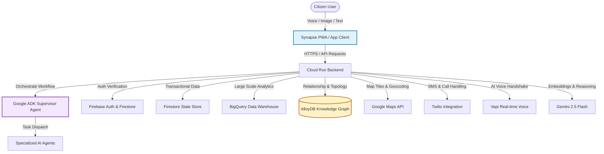
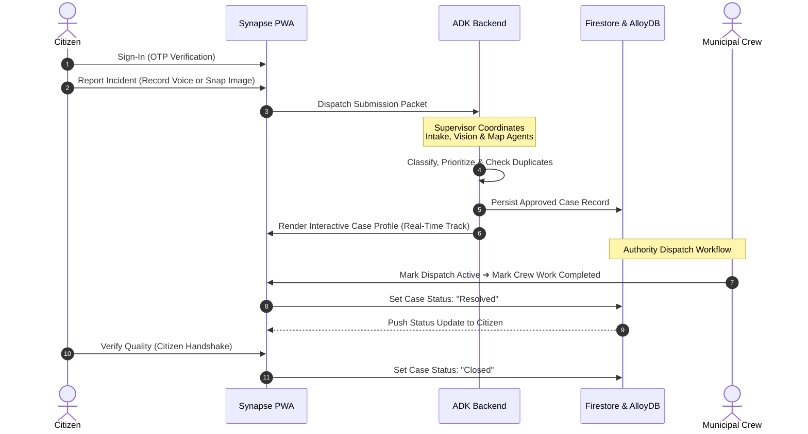

# Synapse Civic Resolution & Decision Intelligence Platform 🏙️

[](#)
[](#)
[](#)


Synapse is an AI-native Civic Resolution & Decision Intelligence Platform built as a Progressive Web Application (PWA). Instead of functioning as a traditional static complaint portal, Synapse operates as an autonomous **AI Case Officer** and decision support hub, transforming raw public submissions into structured, verifiable, and resolved municipal operations.

Designed to meet the requirements of both the **Coding Ninjas Vibe2Ship - Community Hero** and the **Google Gen AI APAC - AI Decision Intelligence Platform** initiatives, Synapse leverages multi-agent orchestration to automate the entire lifecycle of citizen grievances.

---

## 🧭 System Architectures

### Core Application Architecture



---

## ⚡ Core Features

| Feature Module | Operational Description |
| :--- | :--- |
| **OTP Authentication** | Passwordless, secure authentication via phone-based OTP for instant citizen onboarding. |
| **Mobile-First PWA** | Installable, fully offline-resilient app tailored for on-the-spot field reporting. |
| **Voice Complaint Reporting** | Integration via **Twilio & Vapi** allowing hands-free report generation. |
| **Gemini Vision Pipeline** | Analyze and validate raw issue photos (e.g. potholes, leaks) automatically. |
| **AI Categorization** | Multi-label intelligence extraction (title, description, priority, category, department). |
| **Duplicate Prevention** | Geographic & semantic similarity matching to automatically detect duplicate reports. |
| **Dynamic Routing** | Automatic assignment to precise municipal divisions and local wards. |
| **Google ADK Orchestration**| Hierarchical, supervisor-led autonomous agent groups. |
| **Community Handshake** | Interactive citizen-verification step required to officially archive and close cases. |
| **Ward Health Metric** | Dynamic indices scoring local wards based on response speed, density, and closure rates. |
| **Decision Dashboards** | Interactive maps, charts, and workloads for municipality operations leads. |

---

## 🤖 Google ADK: Multi-Agent Orchestration

The intelligence layer is constructed utilizing the **Google Agent Development Kit (ADK)**. A central **Supervisor Agent** coordinates a suite of specialized agents, each executing a single phase of the ingestion and routing pipeline using structured outputs.

```
       [ Citizen Submits Raw Text / Audio / Image ]
                           │
                           ▼
             ┌──────────────────────────┐
             │  Google ADK Supervisor   │
             └─────────────┬────────────┘
                           │
         ┌─────────────────┼─────────────────┐
         ▼                 ▼                 ▼
┌───────────────┐   ┌───────────────┐   ┌───────────────┐
│ Citizen Intake│   │  Validation   │   │ Vision Agent  │
│  Agent (NLP)  │   │  Agent (PWA)  │   │(Gemini Vision)│
└───────────────┘   └───────────────┘   └───────────────┘
         │                 │                 │
         ├─────────────────┼─────────────────┤
         ▼                 ▼                 ▼
┌───────────────┐   ┌───────────────┐   ┌───────────────┐
│   Duplicate   │   │   Authority   │   │Priority/Escal   │
│   Detection   │   │ Mapping Agent │   │  ation Agent  │
└───────────────┘   └───────────────┘   └───────────────┘
         │                 │                 │
         ├─────────────────┼─────────────────┤
         ▼                 ▼                 ▼
┌───────────────┐   ┌───────────────┐   ┌───────────────┐
│ Notification  │   │   Analytics   │   │  Task Status  │
│  Agent (SMS)  │   │  Agent (BQ)   │   │  Update Agent │
└───────────────┘   └───────────────┘   └───────────────┘
```

### Agent Roles & Responsibilities

<details>
<summary><b>🔍 View Detailed Agent Specifications</b></summary>

- **Citizen Intake Agent**: Translates unorganized natural language reports or audio transcripts into clear, structured, and descriptive briefs.
- **Validation Agent**: Checks report inputs for civic relevance, filtering out invalid, inappropriate, or spam submissions.
- **Vision Agent**: Parses raw image attachments using Gemini Vision APIs to verify damage and extract contextual metadata.
- **Duplicate Detection Agent**: Performs semantic and geographic proximity searches to flag if an active case has already been logged.
- **Authority Mapping Agent**: Determines the precise municipal agency, engineering crew, and ward department responsible for resolution.
- **Priority Agent**: Assesses the severity and localized danger level, labeling incoming cases as Low, Medium, High, or Critical.
- **Escalation Agent**: Monitors SLA timers and automatically bumps unresolved critical items to executive review.
- **Notification Agent**: Formulates clear text summaries and dispatches update alerts to reporters and regional leads.
- **Analytics Agent**: Compiles aggregated activity logs, reporting volumes, and response indicators for dashboard consumption.
</details>

---

## 🔄 User Lifecycle Flow



---

## ☁️ Google Cloud Services Integration

Synapse makes native use of the Google Cloud ecosystem to deliver rapid, scalable, and secure decision intelligence:

- **Cloud Run**: Hosts the containerized full-stack Express & Node.js application, scaling down to zero when idle to minimize resource usage.
- **Firestore**: Delivers real-time synchronization of active case workflows, statuses, and profiles directly to citizens and authority dashboards.
- **Firebase Auth**: Secures client entry points utilizing anonymous session handshakes and Google SSO with automated fallback pipelines.
- **BigQuery**: Powerhouse analytics engine digesting closed-case records to generate city-wide predictive insights and performance trends.
- **AlloyDB**: Relational PostgreSQL cluster storing complex knowledge graphs of ward boundaries, crew alignments, and transit routes.
- **Google Maps API**: Renders interactive map pins, handles geo-search queries, and tracks location tracking.
- **Secret Manager**: Secures sensitive Twilio credentials, database keys, and Gemini API endpoints without exposing code variables.
- **Pub/Sub**: Facilitates async decoupled event pipelines for automated SMS notifications and background analytics indexing.

---

## 📊 Analytics & Decision Intelligence

### BigQuery Performance Reporting
BigQuery acts as the brain behind the platform's long-term decision intelligence. It runs continuous, automated analysis on historic cases to extract:
* **Ward Health Score**: A composite index (0-100) scoring wards on response latency, ticket density, and civic satisfaction.
* **Complaint Hotspots**: Spatial-temporal analysis predicting infrastructural failures (e.g. water mains or pavement cracks) before they escalate.
* **Response Efficiencies**: Historic speed indicators tracking how quickly specific departments move from `Dispatched` to `Resolved`.

### AlloyDB Knowledge Graph & Intelligent Routing
To enable autonomous dispatch, AlloyDB stores a highly connected **Knowledge Graph** describing the city's topology:
```
[Ward Boundary] ── (Belongs To) ── [Municipal Division]
       │
   (Patrolled By)
       │
       ▼
 [Engineering Crew] ── (Specializes In) ── [Infrastructural Asset Class]
```
This relationship matrix allows Synapse to instantly query the closest patrolled maintenance unit that specializes in the detected issue, cutting down dispatch lag times to seconds.

---

## 🛠️ Project Structure

The codebase is organized as a modular, full-stack application separating shared services, react context loops, and feature pages:

```
├── .env.example               # Template documenting environmental secret keys
├── firebase-blueprint.json    # Firestore collection & field-type blueprint definitions
├── firestore.rules            # Security rules ensuring user data boundary isolations
├── metadata.json              # Platform declarations and device frame permissions
├── src/
│   ├── App.tsx                # Main Router and layout frame configurations
│   ├── components/            # Reusable UI elements (cards, headers, error boundaries)
│   ├── contexts/              # Central State Providers (Auth, Firebase, Theme, Query)
│   ├── services/              # Core communication wrappers
│   │   ├── adk.ts             # Google ADK Supervisor configurations
│   │   ├── alloydb.ts         # AlloyDB Knowledge Graph queries
│   │   ├── bigquery.ts        # BigQuery Decision Intelligence aggregations
│   │   ├── gemini.ts          # Server-Side Gemini API SDK initialization
│   │   └── twilio.ts / vapi.ts # Communication voice and text endpoints
│   └── features/              # Modular, isolated page views
│       ├── auth/              # Login, registration, and demo access flows
│       ├── citizen/           # Report wizard, maps, and citizen case timelines
│       └── authority/         # Incident dispatch, stats, and workload analytics
```

---

## ⚙️ Environment Configuration

To configure Synapse, copy `.env.example` to `.env` and supply the corresponding configuration parameters:

| Variable Name | Level | Scope & Target |
| :--- | :--- | :--- |
| `GEMINI_API_KEY` | Server | Secret API credentials for Gemini 2.5 models and ADK agents. |
| `DATABASE_URL` | Server | Connection URI targeting the AlloyDB PostgreSQL instance. |
| `BIGQUERY_PROJECT_ID` | Server | Google Cloud Project ID used for BigQuery analytics. |
| `VITE_FIREBASE_API_KEY` | Client | API key for Firebase Firestore and Auth clients. |
| `VITE_FIREBASE_PROJECT_ID`| Client | Target project identifier for Firestore schemas. |
| `TWILIO_ACCOUNT_SID` | Server | Sid key used to dispatch SMS alert updates. |
| `VAPI_API_KEY` | Server | Developer API key powering real-time conversational reports. |

---

## 📦 Getting Started & Installation

### 1. Installation

```bash
# Clone the repository
git clone https://github.com/your-repo/synapse-civic-portal.git
cd synapse-civic-portal

# Install all workspace dependencies
npm install
```

### 2. Local Development

```bash
# Start the full-stack development server
npm run dev
```
Open [http://localhost:3000](http://localhost:3000) in your browser.

### 3. Production Build & Execution

To bundle the frontend assets and compile the server entry points:
```bash
# Compile and build using Vite and Esbuild
npm run build

# Start the optimized server environment
npm run start
```

### 4. Deploying to Cloud Run

Deploy the container directly to your GCP project:
```bash
gcloud run deploy synapse-civic-portal \
    --source . \
    --platform managed \
    --region us-central1 \
    --allow-unauthenticated
```

---

## 🔮 Future Roadmap

- [ ] **Satellite Infra-Scanning**: Connect to Sentinel-2 public imagery to proactively detect heavy road decay.
- [ ] **Decentralized Citizen Rewards**: Tokenized utility credit discounts for residents actively verifying resolutions.
- [ ] **Municipal Drone Dispatch**: Integration with automated flight routes to capture visual aerial verification.
- [ ] **Predictive Maintenance Cycles**: Forecast water main breakdowns by cross-referencing BigQuery reports with local weather models.
- [ ] **Digital Twin Topology**: High-fidelity 3D modeling of ward infrastructure using Google Maps Photorealistic 3D Tiles.
- [ ] **Cross-Language Voice Translation**: Instant, multi-lingual audio synthesis allowing reporting in native languages.
- [ ] **Smart IoT Water Sensor Hooks**: Automatic case filing when flow indicators report dropouts or leaks.
